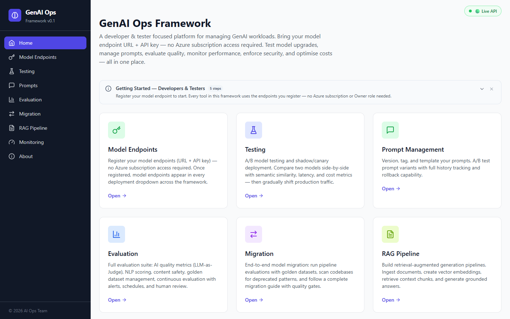
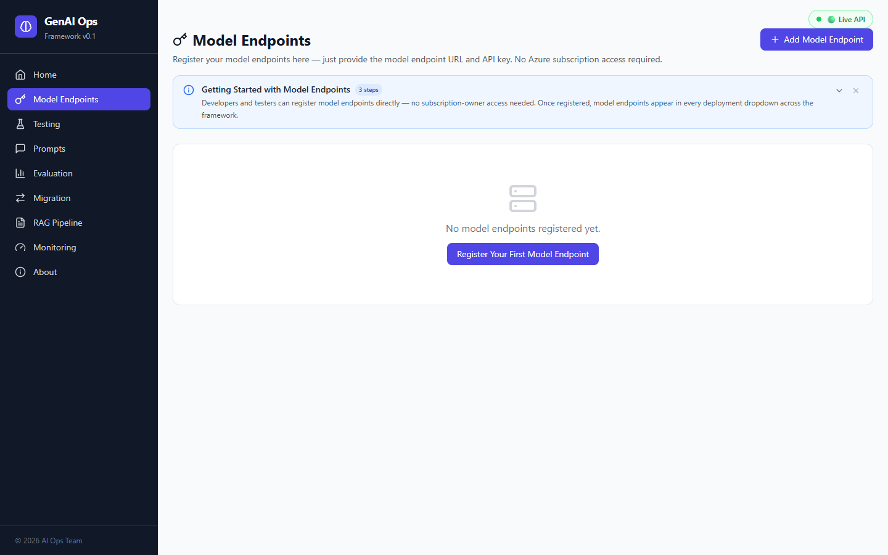
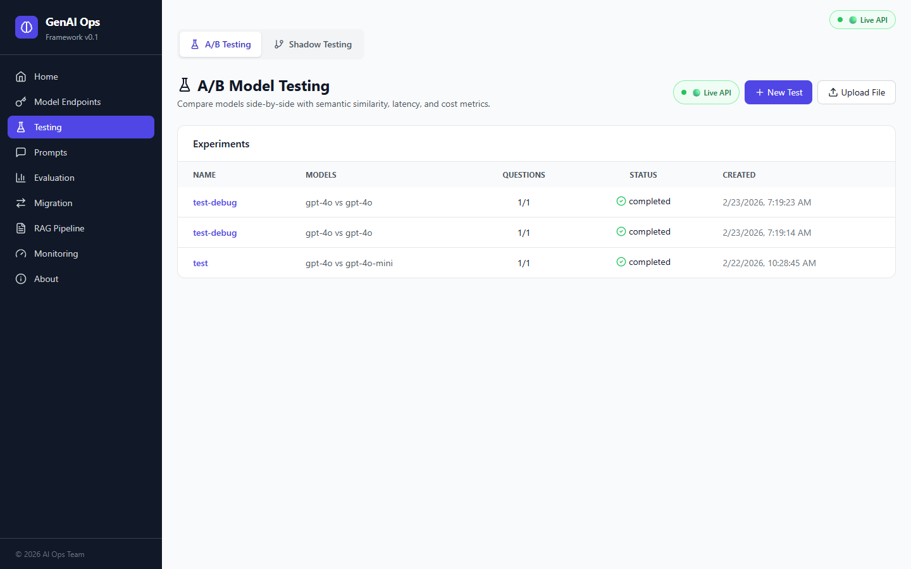
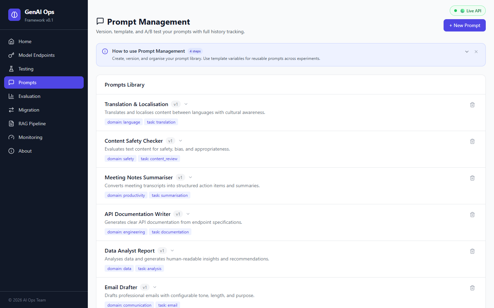
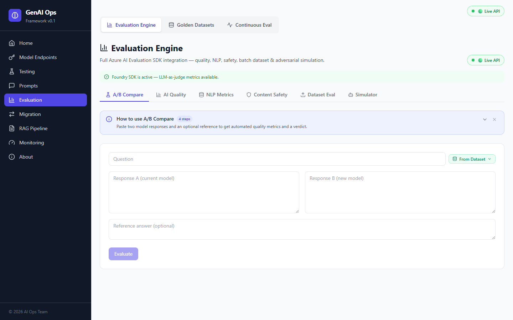
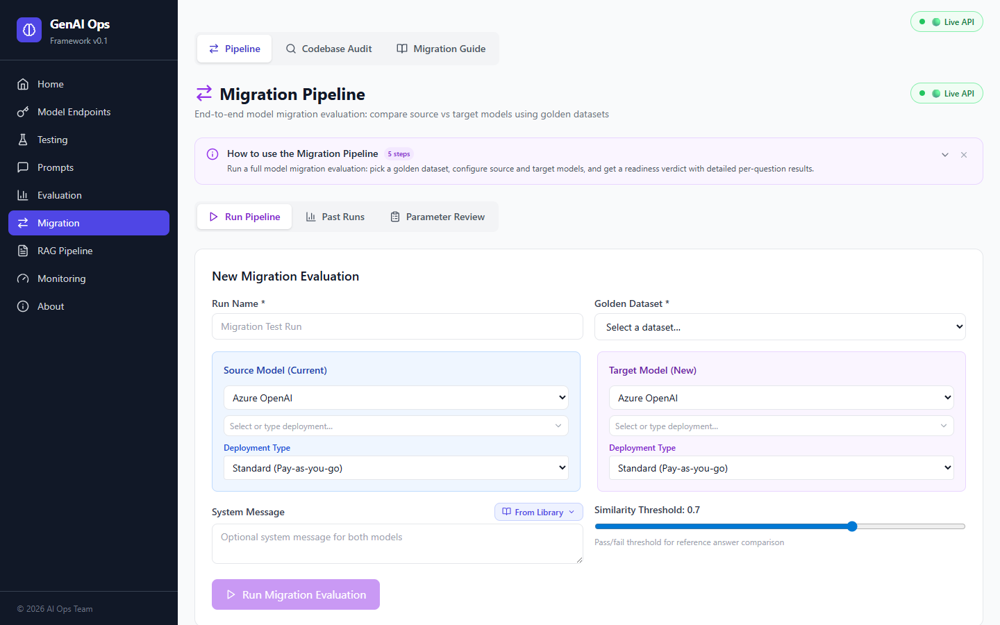
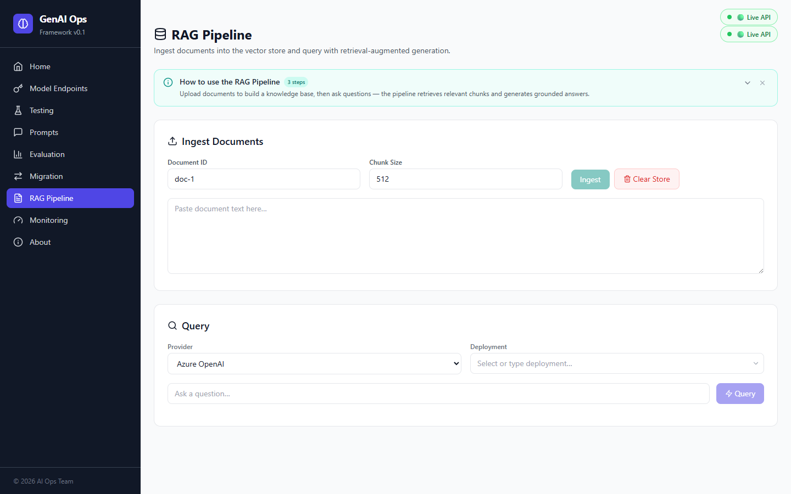
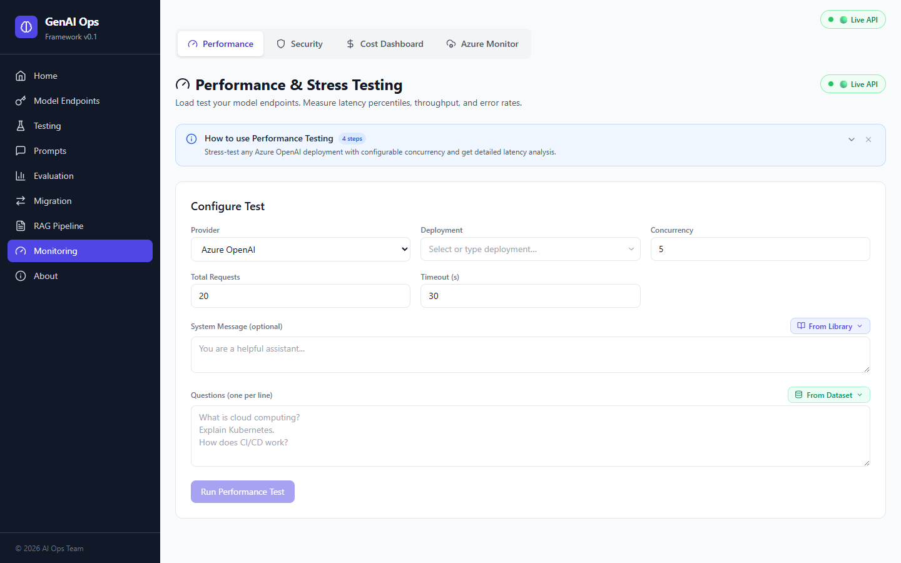
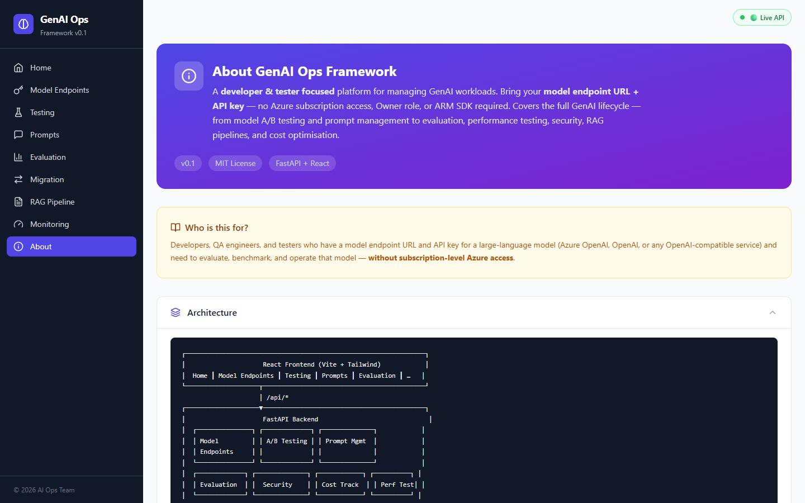

# GenAI Ops Framework

A **developer & tester focused** platform for managing GenAI workloads. Bring your **model endpoint URL + API key** — no Azure subscription access, Owner role, or ARM SDK required. Covers the full GenAI lifecycle — from model **A/B testing** and **prompt management** to **evaluation**, **performance testing**, **security**, **RAG pipelines**, and **cost optimisation**.

> **Who is this for?**
> Developers, QA engineers, and testers who have a model endpoint URL and API key for a large-language model (Azure OpenAI, OpenAI, or any OpenAI-compatible service) and need to evaluate, benchmark, and operate that model without subscription-level Azure access.

<p align="center">
  
</p>

---

## Architecture

```
┌─────────────────────────────────────────────────────────────────┐
│                     React Frontend (Vite + Tailwind)            │
│  Home ┃ Model Endpoints ┃ A/B Testing ┃ Prompts ┃ Evaluation ┃ …    │
└────────────────────┬────────────────────────────────────────────┘
                     │ /api/*
┌────────────────────▼────────────────────────────────────────────┐
│                     FastAPI Backend                              │
│  ┌───────────────┐ ┌─────────────┐ ┌──────────────┐            │
│  │ Model         │ │ A/B Testing │ │ Prompt Mgmt  │            │
│  │ Endpoints     │ │             │ │              │            │
│  └───────────────┘ └─────────────┘ └──────────────┘            │
│  ┌─────────────┐ ┌──────────────┐ ┌────────────┐ ┌──────────┐ │
│  │ Evaluation  │ │  Security    │ │ Cost Track  │ │ Perf Test│ │
│  └─────────────┘ └──────────────┘ └────────────┘ └──────────┘ │
│  ┌─────────────┐ ┌──────────────────────────────────────────┐  │
│  │ RAG Pipeline│ │ Azure Monitor (optional — sub owners)     │  │
│  └─────────────┘ └──────────────────────────────────────────┘  │
│                                                                  │
│  Model Provider Layer (Azure OpenAI / OpenAI / Custom HTTP)     │
│  ↑ model endpoints + keys come from Model Endpoints registry     │
└────────────────────┬────────────────────────────────────────────┘
                     │
        ┌────────────▼────────────┐
        │  SQLite / PostgreSQL    │
        │  + data/endpoints.json  │
        └─────────────────────────┘
```

### Key concept — Model Endpoints

The **Model Endpoints** page is the primary way to configure model access. Developers register one or more model endpoints (URL + API key + deployment name), and every tool in the framework (A/B testing, performance, security, evaluation, etc.) can use those registered model endpoints via the deployment dropdown.

Azure subscription scanning (Azure Monitor page) is kept as an **optional** feature for users who *do* have subscription-level access. It is never required.

---

## Screenshots

A visual tour of the framework's main pages.

| | |
|---|---|
| **Home / Dashboard** | **Model Endpoints** |
|  |  |
| **A/B & Shadow Testing** | **Prompt Engineering** |
|  |  |
| **Evaluation Hub** | **Migration & Pipeline** |
|  |  |
| **RAG Pipeline** | **Monitoring** |
|  |  |
| **About** | |
|  | |

---

## Features

### 1. Model Endpoints (primary entry point)


- Register model endpoints with **URL + API key** — works for Azure OpenAI, OpenAI, and any OpenAI-compatible service
- **Test connectivity** with a single click — verifies the model endpoint is reachable and returns a valid response
- Enable / disable model endpoints without deleting them
- All registered model endpoints appear automatically in **every deployment dropdown** across the framework
- Persisted to `data/endpoints.json` (no database needed for model endpoint config)

### 2. A/B Model Testing


- Upload questions from **Excel (.xlsx), CSV, or JSON** files
- Run each question against **two registered model endpoints** concurrently
- **Side-by-side response comparison** in the UI
- Automatic **semantic similarity scoring** (0–100%)
- Latency and cost comparison per question
- **Human preference voting** (Model A / Model B / Tie)
- Aggregated summary with similarity distribution

### 3. Prompt Engineering & Management


- Create, version, and tag prompts
- **Template engine** with `{{variable}}` interpolation
- Activate/deactivate prompt versions with one click
- Full version history with rollback
- Render and preview templates with test variables

### 4. Evaluation Engine


- **Semantic similarity** via sentence-transformer embeddings (cosine)
- **BLEU score** (unigram precision + brevity penalty)
- **ROUGE-L** (longest common subsequence F1)
- **Coherence heuristics** (sentence structure, repetition)
- Batch evaluation for bulk comparison
- Verdict classification: `similar` / `needs_review` / `divergent`

### 5. Performance & Stress Testing
- Configurable **concurrency** (1–200 concurrent workers)
- Latency percentiles: **P50, P90, P99, min, max**
- **Requests per second** throughput measurement
- **Tokens per second** throughput
- Error rate tracking with detailed error logs
- Total cost estimation per test

### 6. Security & Safety
- **Prompt injection** pattern detection (15+ patterns)
- **Toxicity / harmful content** keyword scanning
- **PII detection & redaction** (email, phone, SSN, credit card, IP)
- **Jailbreak** pattern matching
- Combined full security check with risk-level scoring

### 7. RAG Pipeline


- Document ingestion with configurable **chunk size** and overlap
- **In-memory vector store** (numpy-based cosine search)
- Sentence-transformer embeddings for chunks
- Context-augmented generation with retrieved chunks
- Pluggable — extend to FAISS, Pinecone, Azure AI Search, etc.

### 8. Cost Optimisation
- Automatic **token usage & cost tracking** per API call
- Daily cost breakdown and per-deployment aggregation
- **Model cascading** — cheapest model first, escalate if confidence is low
- Configurable confidence thresholds
- Cost alert thresholds

### 9. Azure OpenAI Monitor (optional)


> **Requires Azure subscription-level access.** Developers and testers can skip this — use the Model Endpoints page instead.

- Scan an Azure subscription to auto-discover all OpenAI / AI Services accounts
- List deployments per account with 7-day usage metrics from Azure Monitor
- Usage-level badges (No usage / Low / Medium / High)
- Test individual deployments directly from the UI

### 10. Continuous Evaluation
- End-to-end evaluation pipeline: UX metrics (helpfulness, tone, completeness), safety alerts, scheduled runs, human review, and metric trend analysis — inspired by Microsoft Foundry.

---

## Quick Start

### Prerequisites
- Python 3.10+
- Node.js 18+
- A model endpoint URL and API key (Azure OpenAI, OpenAI, or any OpenAI-compatible service)
- (Optional) Docker & Docker Compose
- (Optional) Azure CLI login — only needed for Azure Monitor scanning

### 1. Backend

```bash
cd aiopsframework

# Create virtual environment
python -m venv .venv
.venv\Scripts\activate   # Windows
# source .venv/bin/activate  # macOS/Linux

# Install dependencies
pip install -e ".[dev]"

# Copy and configure environment
copy .env.example .env
# Edit .env — at minimum set your model endpoint + API key

# Run the backend
uvicorn backend.main:app --reload --port 8000
```

API docs: http://localhost:8000/docs

### 2. Frontend

```bash
cd frontend
npm install
npm run dev
```

UI: http://localhost:5173

### 3. Register your first model endpoint

1. Open http://localhost:5173/model-endpoints
2. Click **Add Model Endpoint**
3. Enter your model endpoint URL, API key, and deployment name
4. Click **Test** to verify connectivity
5. The model endpoint now appears in every deployment dropdown across the framework

### Docker

```bash
# Development (hot-reload for both frontend + backend)
docker-compose up

# Production build
docker build -t genaiops .
docker run -p 80:80 --env-file .env genaiops
```

---

## API Routes

| Module | Method | Route | Description |
|---|---|---|---|
| **Model Endpoints** | POST | `/api/model-endpoints` | Register a new model endpoint |
| | GET | `/api/model-endpoints` | List all registered model endpoints |
| | GET | `/api/model-endpoints/deployments` | List model endpoints as deployment info (for dropdowns) |
| | GET | `/api/model-endpoints/{id}` | Get model endpoint detail |
| | PUT | `/api/model-endpoints/{id}` | Update model endpoint |
| | DELETE | `/api/model-endpoints/{id}` | Delete model endpoint |
| | POST | `/api/model-endpoints/{id}/test` | Test model endpoint connectivity |
| **A/B Testing** | POST | `/api/experiments` | Create & run A/B experiment |
| | POST | `/api/experiments/upload` | Upload file & run A/B test |
| | GET | `/api/experiments` | List all experiments |
| | GET | `/api/experiments/{id}` | Get experiment detail + results |
| | GET | `/api/experiments/{id}/summary` | Get aggregated metrics |
| | PUT | `/api/experiments/{id}/results/{rid}/feedback` | Submit human preference |
| **Prompts** | POST | `/api/prompts` | Create prompt |
| | GET | `/api/prompts` | List prompts |
| | GET | `/api/prompts/{id}` | Get prompt with versions |
| | PATCH | `/api/prompts/{id}` | Update prompt |
| | DELETE | `/api/prompts/{id}` | Delete prompt |
| | POST | `/api/prompts/{id}/versions` | Create new version |
| | POST | `/api/prompts/{id}/render` | Render template |
| **Evaluation** | POST | `/api/evaluate` | Compare two responses |
| | POST | `/api/evaluate/batch` | Batch comparison |
| **Performance** | POST | `/api/performance/test` | Run stress/load test |
| **Security** | POST | `/api/security/check` | Full security scan |
| | POST | `/api/security/injection` | Injection detection |
| | POST | `/api/security/toxicity` | Toxicity check |
| | POST | `/api/security/pii` | PII detection + redaction |
| **Costs** | GET | `/api/costs/summary` | Cost summary (daily, by deployment) |
| | POST | `/api/costs/cascade` | Run model cascade |
| **RAG** | POST | `/api/rag/ingest` | Ingest documents |
| | POST | `/api/rag/query` | RAG query |
| | DELETE | `/api/rag/store` | Clear vector store |
| **Azure Monitor** *(optional)* | POST | `/api/azure-monitor/scan` | Scan a subscription |

---

## Project Structure

```
aiopsframework/
├── backend/
│   ├── main.py                 # FastAPI entry point
│   ├── config.py               # Settings from .env
│   ├── database.py             # Async SQLAlchemy setup
│   ├── models/                 # ORM models (Prompt, Experiment, TestRun, Cost)
│   ├── schemas/                # Pydantic request/response schemas
│   ├── api/
│   │   ├── endpoint_registry.py # Model endpoint CRUD + test
│   │   ├── ab_testing.py       # A/B experiment endpoints
│   │   ├── prompts.py          # Prompt CRUD + versioning
│   │   ├── evaluation.py       # Response comparison
│   │   ├── performance.py      # Stress testing
│   │   ├── security.py         # Security scans
│   │   ├── cost.py             # Cost tracking + cascade
│   │   ├── rag.py              # RAG pipeline
│   │   └── azure_monitor.py    # (Optional) Azure subscription scanning
│   ├── services/
│   │   ├── endpoint_registry.py # Model endpoint storage + test
│   │   ├── model_provider.py   # Unified LLM abstraction
│   │   ├── ab_testing.py       # A/B engine
│   │   ├── evaluation.py       # Similarity/BLEU/ROUGE metrics
│   │   ├── prompt_manager.py   # Prompt versioning + templates
│   │   ├── performance.py      # Load test executor
│   │   ├── security.py         # Injection/PII/toxicity detection
│   │   ├── cost_tracker.py     # Cost recording + model cascade
│   │   ├── rag_pipeline.py     # RAG with vector store
│   │   └── azure_monitor.py    # (Optional) Azure subscription scanning
│   └── utils/
│       ├── file_parser.py      # Excel/CSV/JSON parser
│       └── metrics.py          # Shared metric helpers
├── data/
│   └── endpoints.json          # Registered model endpoints (auto-created)
├── frontend/
│   ├── src/
│   │   ├── App.tsx             # Route definitions
│   │   ├── api/client.ts       # Axios API client
│   │   ├── components/
│   │   │   ├── Layout.tsx      # Sidebar navigation
│   │   │   └── DeploymentSelect.tsx  # Model endpoints → Azure dropdown
│   │   ├── pages/
│   │   │   ├── Home.tsx
│   │   │   ├── EndpointsPage.tsx       # Primary: manage model endpoints
│   │   │   ├── ABTestingPage.tsx
│   │   │   ├── ExperimentDetailPage.tsx
│   │   │   ├── PromptsPage.tsx
│   │   │   ├── EvaluationPage.tsx
│   │   │   ├── PerformancePage.tsx
│   │   │   ├── SecurityPage.tsx
│   │   │   ├── DashboardPage.tsx
│   │   │   └── AzureMonitorPage.tsx    # Optional: subscription scanning
│   │   └── types/index.ts
│   └── package.json
├── tests/
│   ├── test_evaluation.py
│   ├── test_security.py
│   ├── test_file_parser.py
│   └── test_prompt_manager.py
├── Dockerfile
├── docker-compose.yml
├── pyproject.toml
├── .env.example
└── README.md
```

---

## Running Tests

```bash
pip install -e ".[dev]"
pytest tests/ -v
```

---

## Deployment to Customers

This framework is designed for **developer & tester teams** who receive model endpoint credentials and need to validate, benchmark, and operate those models:

1. **Container deployment** — Single Docker image with both frontend and backend
2. **Kubernetes / AKS** — Use the Dockerfile with a Helm chart (add your own)
3. **Azure App Service** — Deploy the Docker image directly
4. **Environment separation** — Each team/customer gets their own `.env` with their model endpoint credentials
5. **No subscription access needed** — Developers only need the model endpoint URL + API key

### Recommended deployment pattern:
```
Customer / Team Environment
├── GenAI Ops Framework  ← this solution
├── Model Endpoints (Azure OpenAI, OpenAI, etc.)
│   └── accessed via URL + API key
└── (Optional) Vector Database (Azure AI Search, etc.)
```

---

## Extending

- **Add new LLM providers**: Implement a new `_call_*` function in `backend/services/model_provider.py`
- **External vector DB**: Replace `InMemoryVectorStore` with FAISS, Pinecone, Weaviate, or Azure AI Search
- **Authentication**: Add OAuth2/Azure AD middleware to `backend/main.py`
- **External model endpoint store**: Replace `data/endpoints.json` with a database or secret manager
- **CI/CD**: Add GitHub Actions or Azure DevOps pipeline
- **Monitoring**: Prometheus metrics endpoint is ready (add `/metrics` route)

---

## License

MIT
